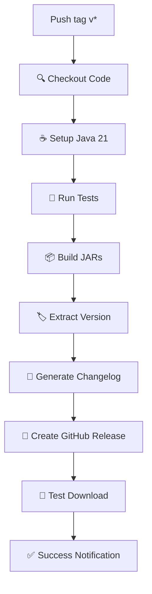

# 🚀 Guide de Release - Traducteur Automatique

Ce document explique comment créer une nouvelle release du Traducteur Automatique avec la CI/CD automatisée.

## 📋 Vue d'Ensemble

Le processus de release est entièrement automatisé via GitHub Actions. Quand vous créez un tag au format `vX.Y.Z`, la CI/CD :

1. ✅ **Compile** le projet avec Java 21
2. 🧪 **Teste** l'application sur plusieurs OS
3. 📦 **Crée** les JARs optimisés
4. 📝 **Génère** les notes de version automatiquement
5. 🚀 **Publie** la release sur GitHub
6. 🔍 **Teste** le téléchargement et le lancement

## 🎯 Méthode Recommandée : Script Automatique

### Utilisation du Script

```bash
# Rendre le script exécutable
chmod +x create-release.sh

# Créer une release (mode interactif)
./create-release.sh

# Ou directement avec une version
./create-release.sh 1.0.0
```

Le script va :
- ✅ Vérifier tous les prérequis
- 📝 Mettre à jour la version dans `pom.xml`
- 🧪 Compiler et tester le projet
- 🏷️ Créer le tag Git
- 🚀 Pousser et déclencher la CI/CD

## 🛠️ Méthode Manuelle

Si vous préférez faire les étapes manuellement :

### 1. Prérequis

```bash
# Être sur main/master et à jour
git checkout master
git pull origin master

# Vérifier qu'il n'y a pas de modifications non commitées
git status
```

### 2. Mise à Jour de la Version

Éditez `pom.xml` et changez :
```xml
<version>1.0-SNAPSHOT</version>
```
en :
```xml
<version>1.0.0</version>
```

### 3. Build et Test

```bash
# Nettoyer et compiler
mvn clean compile

# Tester (optionnel)
mvn test

# Créer les packages
mvn clean package -DskipTests
```

### 4. Commit et Tag

```bash
# Committer la version
git add pom.xml
git commit -m "🚀 Release v1.0.0"

# Créer le tag
git tag -a v1.0.0 -m "Release v1.0.0"

# Pousser
git push origin master
git push origin v1.0.0
```

## 🔄 Pipeline CI/CD

### Déclencheur

```yaml
on:
  push:
    tags:
      - 'v*'  # v1.0.0, v2.1.3, etc.
```

### Artefacts Créés

Pour chaque release, la CI/CD crée :

1. **`traducteur-automatique-X.Y.Z.jar`**
    - Application complète avec toutes les dépendances
    - Prête à l'emploi avec `java -jar`

2. **`traducteur-automatique-X.Y.Z-shaded.jar`**
    - Version optimisée avec Maven Shade Plugin
    - Plus petite et plus rapide

3. **`traducteur-automatique-X.Y.Z-complete.zip`**
    - Archive complète avec JARs + scripts + README
    - Parfait pour une distribution complète

4. **Scripts de lancement**
    - `run.bat` (Windows)
    - `run.sh` (Linux/Mac)

5. **Documentation**
    - `README.md` mis à jour

### Workflow Détaillé



## 📊 Types de Versions

### Semantic Versioning

Le projet utilise [Semantic Versioning](https://semver.org/) :

- **MAJOR** (`X.0.0`) : Changements incompatibles
- **MINOR** (`X.Y.0`) : Nouvelles fonctionnalités compatibles
- **PATCH** (`X.Y.Z`) : Corrections de bugs compatibles

### Exemples

```bash
# Correction de bug
./create-release.sh 1.0.1

# Nouvelle fonctionnalité
./create-release.sh 1.1.0

# Changement majeur
./create-release.sh 2.0.0

# Pre-release (optionnel)
./create-release.sh 1.0.0-rc1
```

## 🔍 Vérifications Automatiques

### Tests Multi-OS

La CI/CD teste automatiquement sur :
- ✅ **Ubuntu Latest** (Linux)
- ✅ **Windows Latest**
- ✅ **macOS Latest**

### Contrôles de Qualité

- 🔐 **Scan de sécurité** avec OWASP Dependency Check
- 📏 **Qualité du code** avec SpotBugs
- ⚡ **Tests de performance** et mémoire
- 🌐 **Tests de connectivité** aux APIs
- 🔗 **Tests d'intégration** complets

### Validation des Artefacts

- ✅ JARs créés et non vides
- ✅ Application se lance correctement
- ✅ Scripts de lancement valides
- ✅ Téléchargement depuis GitHub fonctionne

## 📝 Notes de Version Automatiques

Les notes de version sont générées automatiquement et incluent :

1. **📋 Liste des commits** depuis la dernière version
2. **📦 Description des fichiers** inclus dans la release
3. **🛠️ Instructions d'installation**
4. **⚡ Prérequis** système

Exemple de génération :
```markdown
## 🚀 Nouveautés dans cette version

### 📋 Commits depuis v1.0.0:
- ✨ Ajout du thème Dracula (John Doe)
- 🐛 Correction du bug OCR multi-écrans (Jane Smith)
- 📚 Mise à jour de la documentation (Bot)

### 📦 Fichiers inclus dans cette release:
- **traducteur-automatique-1.1.0.jar** - Application complète
- **traducteur-automatique-1.1.0-shaded.jar** - Version optimisée
- **run.bat/run.sh** - Scripts de lancement

### 🛠️ Installation:
```bash
java -jar traducteur-automatique-1.1.0.jar
```
```

## 🚨 Gestion des Erreurs

### Échec de Build

Si le build échoue :
1. ❌ **Pas de release créée**
2. 📧 **Notification d'échec** sur GitHub
3. 🔍 **Logs détaillés** dans Actions

### Rollback

Pour annuler une release problématique :

```bash
# Supprimer le tag local
git tag -d v1.0.0

# Supprimer le tag distant
git push origin :refs/tags/v1.0.0

# Supprimer la release sur GitHub (manuellement via l'interface)
```

## 🎯 Meilleures Pratiques

### Avant la Release

1. ✅ **Tester localement** avec `mvn clean package`
2. ✅ **Vérifier les fonctionnalités** critiques
3. ✅ **Mettre à jour README.md** si nécessaire
4. ✅ **Créer/fermer les issues** concernées

### Timing

- 🕒 **Éviter** les releases le vendredi après-midi
- 🕒 **Préférer** les créneaux avec disponibilité pour support
- 🕒 **Attendre** la fin des tests CI avant communication

### Communication

1. 📢 **Annoncer** les releases majeures à l'avance
2. 📋 **Documenter** les breaking changes
3. 🐛 **Communiquer** rapidement sur les corrections critiques

## 📞 Support

### En cas de Problème

1. 🔍 **Consulter** les logs GitHub Actions
2. 🧪 **Reproduire** localement avec Maven
3. 🎫 **Créer une issue** avec détails complets
4. 📧 **Contacter** les mainteneurs si critique

### Logs Utiles

```bash
# Logs Maven détaillés
mvn clean package -X

# Test du JAR
java -jar target/*.jar --version

# Vérification Git
git log --oneline -10
git tag -l | tail -5
```

## ✅ Checklist Release

### Pré-Release

- [ ] Branch main/master à jour
- [ ] Pas de modifications non commitées
- [ ] Tests locaux passent
- [ ] Version incrémentée correctement
- [ ] README.md à jour

### Post-Release

- [ ] Release visible sur GitHub
- [ ] Artefacts téléchargeables
- [ ] Application se lance correctement
- [ ] Notes de version correctes
- [ ] Communication effectuée (si nécessaire)

---

## 🎉 C'est Tout !

Avec cette configuration, créer une release est aussi simple que :

```bash
./create-release.sh 1.2.3
```

Et quelques minutes plus tard, votre release est prête et disponible pour tous les utilisateurs ! 🚀